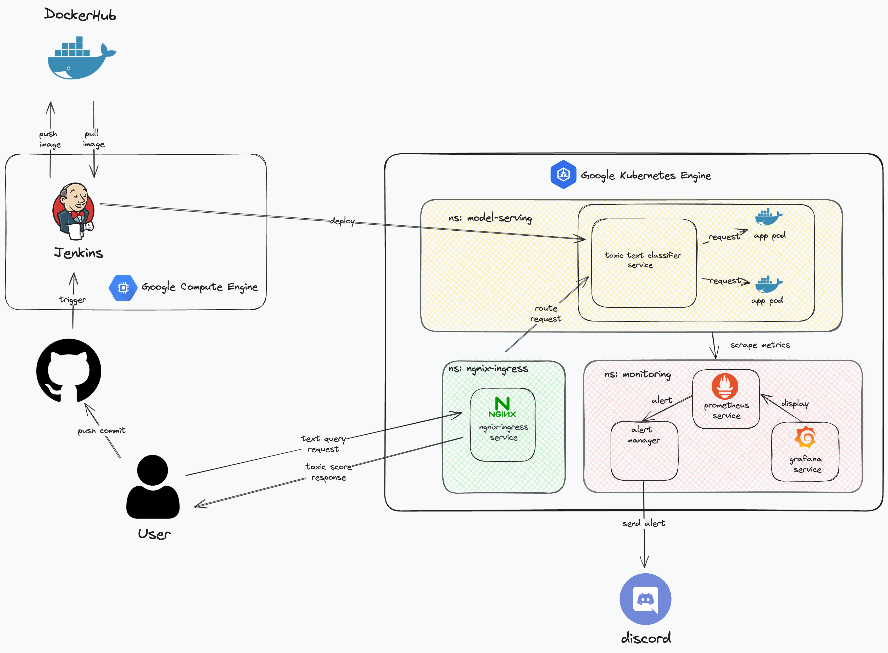

# Build Toxic Text Classification App


## Overall System Architecture



## 1. Installment and Local Service

### 1.1 Requirements
```
pip install -r requirements.txt
```
### 1.2 Docker

```
docker pull khoav1371999/classify_toxic_text:0.0.1 
docker run -p 8081:30000 khoav1371999/classify_toxic_text:0.0.1 
```
### 1.3 Local Testing

Run ```client.py``` to test local API.

```
python3 client.py --save_dir toxic_classication.html --text_query your_text
```

## 2. Model

Utilized pretrained [DistilBERT](https://huggingface.co/transformers/v3.0.2/model_doc/distilbert.html) and incorporated two linear layers for the task of toxic text classification.

I use Jigsaw Toxic Comment Classification Challenge dataset to train and evaluate model. You can find details of the contest [here](https://www.kaggle.com/c/jigsaw-toxic-comment-classification-challenge/data).

```bash
kaggle competitions download -c jigsaw-toxic-comment-classification-challenge -p classifier_model/data
unzip classifier_model/data/jigsaw-toxic-comment-classification-challenge.zip -d classifier_model/data
```


### 2.1 Model Architecture


### 2.2 Model Specification

##### 2.2.1 Configuration

- Total Parameters: $68,728,321$
- Model Size: $262$ MB
- Optimizer: Adam
- Loss Function: Binary Cross Entropy
- Batch Size: $64$
- Linear Layer 1 Learning Rate: $5*10^{-4}$
- Linear Layer 2 Learning Rate: $1*10^{-5}$

##### 2.2.2 Train Loss


##### 2.2.3 Evaluation


## 3. Manual Deployment On Google Kubernetes Engine

### 3.1 Nginx-Controller
```
cd helm/nginx-ingress    
kubectl create ns nginx-ingress 
kubens nginx-ingress
helm upgrade --install nginx-ingress-controller . 
```

### 3.2 Deploy Toxic Text Classifier Service
```
cd helm/toxic_chart
kubectl create ns model-serving
kubens model-serving
helm upgrade --install classify-toxic-text .
```

Get the ingress IP address
```
kubectl get ingress -n model-serving
```
The service can be accessed via `http://[INGRESS_IP_ADDRESS]/docs`


### 3.3 GKE Monitoring with Prometheus and Grafana
This setup guide provides the steps to deploy Prometheus and Grafana for monitoring CPU and node metrics on Google Kubernetes Engine (GKE). Follow the steps in sequence to ensure correct deployment within the monitoring namespace using Helm charts.
##### 3.3.1 Create Monitoring Namespace
```
kubectl create ns monitoring
```

##### 3.3.2 Prometheus

Deploy Prometheus Operator CRDs 

```
cd helm_charts/prometheus-operator-crds
kubens monitoring
helm upgrade --install prometheus-crds .
```

Deploy Prometheus  

```
cd helm_charts/prometheus
kubens monitoring
helm upgrade --install prometheus .
```

Prometheus Service can be accessed via `http://[Node_IP_ADDRESS]:30000`

##### 3.3.3 Grafana

```
cd helm_charts/grafana
kubens monitoring
helm upgrade --install grafana .
```

Grafana Service can be accessed via `http://[Node_IP_ADDRESS]:30001`


## 4. Continuous Deployment On Google Kubernetes Engine with Jenkins

### 4.1 Set Up GCE instance with Ansible

Ensure you have the following prerequisites installed and set up:

- Ansible: Ansible must be installed on your local machine or a control machine that can access your Google Cloud resources.
- Google Cloud SDK: Install and configure the Google Cloud SDK (gcloud) for command-line access to your Google Cloud resources.

##### 4.1.1 Set up Google Cloud credentials:

- Create a new project or select an existing project in the Google Cloud Console.
- Enable the Compute Engine API for your project.
- Create a service account with appropriate permissions (Compute Admin) and download the JSON key file.
- Insert the JSON key file into the `secrets` directory.

##### 4.1.2 Set up Google Cloud Compute Engine instance and Install Docker and Jenkins
```
cd ansible/playbook
ansible-playbook create_compute_instance.yaml
```
After your instance has been started as the folowing image, get the External IP (e.g., `34.102.7.69` as in the example) and replace it in the inventory file


Then, run the following commands:
    
```
cd ansible/playbook
ansible-playbook ansible-playbook -i ../inventory install_and_run_jenkins.yaml
```


### 4.2 Set Up Jenkins
##### 4.2.1 Jenkins UI Access
- Jenkins UI can be accessed via  `GCE_INSTANCE_EX_IP:8081`

Password can be found:
```
docker logs jenkins
```

##### 4.2.2 Install Jenkins Plugins
- Install the following plugins:
    - Docker Pipeline
    - Docker
    - Kubernetes
    - Google SDK

##### 4.2.3 Connect to Github repo
- Add Jenkins IP_ADDRESS to webhook in toxic-text-classifier Github repo


##### 4.2.4 Set Up Jenkins Credentials
- Add Github credentials to Jenkins


- Add DockerHub credentials to Jenkins

    - Create a new credential with the following information:
        - Kind: Username with password
        - Scope: Global
        - Username: Your DockerHub username
        - Password: DockerHub Access Token (Refer to [DockerHub](https://hub.docker.com/settings/security) to create a new token
        - ID: dockerhub


- Add Google Cloud credentials to Jenkins via `Manage Jenkins/ Cloud` with the following information:
    - Kubernetes URL: YOUR GKE CLUSTER URL
    - Kubernetes Namespace: model-serving
    - Credentials: Kubernetes server certificate key


### 4.3 Jenkins Pipeline
There are three stages in the Jenkins pipeline:
    - Test: Run the test
    - Build: Build the Docker image
    - Deploy: Deploy the Docker image to GKE


The console output of the successful pipeline is shown below:


## Future Work

1. Utilize BERT model for better performance & Explore/ Experiment fine-tuning embeddings layer
2. Utilize more data for training (specifically for cases with syntax errors)
3. Model Monitoring System over time


